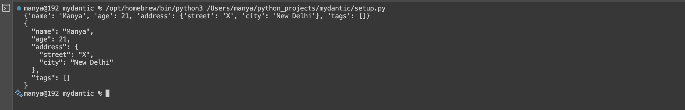

# mydantic

mydantic is a small, dependency-light Python library for defining typed data models with validation and coercion. It provides a familiar, minimal API inspired by projects like pydantic while remaining intentionally lightweight for learning and small projects.

## Key features

- Declarative models via `BaseModel` and field descriptors
- Built-in field types: `StringField`, `IntField`, `FloatField`, `BoolField`, `ListField`, `ModelField`
- Type coercion for common primitives (str, int, float, bool)
- Nested model parsing via `ModelField`
- Per-field validators (callables)
- Structured error reporting via `FieldError` and `ValidationError`


## Quick start

Define models using field descriptors. Fields are descriptors so they validate/coerce on assignment and during model initialization.

```py
from product import BaseModel, StringField, IntField, ListField, ModelField

class Address(BaseModel):
    street = StringField()
    city = StringField()

class User(BaseModel):
    name = StringField()
    age = IntField()
    address = ModelField(Address)
    tags = ListField(item_type=str, default=[])

u = User(name="Manya", age="21", address={"street":"X", "city":"New Delhi"})
print(u.dict())
print(u.json(indent=2))

```


Notes:
- `ModelField` accepts either an instance of the nested model or a `dict` to parse into the nested model.
- `ListField(item_type)` will validate each list item and surface index-aware `FieldError`s (e.g. `field_name[2]`).

## Error handling

Errors are represented by `FieldError` objects and aggregated as `ValidationError` when multiple field-level errors occur.

`FieldError` attributes:
- `field_name`: name of the field (may include index or nested path)
- `value`: the value that failed validation/coercion
- `expected`: expected type or shape
- `message`: human-readable message
- `original_exception`: optional underlying exception

Example handling:

```py
try:
    User(name=None)
except ValidationError as e:
    print(str(e))
    for fe in e.errors:
        print(fe.to_dict())
```

## API reference (core)

Primary exports (see `product/__init__.py`):

- `BaseModel` — metaclass-driven base for declarative models. Key methods:
  - `__init__(**kwargs)` — validate/assign fields
  - `parse_obj(obj: dict)` — classmethod to parse a mapping
  - `dict()` — produce a serializable dict
  - `json(**kwargs)` — JSON serialization convenience
  - `copy(**updates)` — shallow copy with updates
- Field classes:
  - `Field` — base descriptor
  - `StringField`, `IntField`, `FloatField`, `BoolField` — typed field descriptors
  - `ListField(item_type)` — list of items with per-item validation
  - `ModelField(model_class)` — nested model field
- Errors:
  - `FieldError`, `ValidationError`

Explore the source files (`product/fields.py`, `product/models.py`, `product/errors.py`) for implementation details and additional behavior (coercion, validators, nested parsing, etc.).

## Design notes and behavior

- Fields try to coerce common primitive types (e.g., `"123"` -> `int`). If coercion fails, a `ValidationError` is raised with a `FieldError` cause.
- When nested `ValidationError`s occur (e.g., setting a `ModelField` with invalid nested data), errors are flattened and reported with appropriately prefixed field names.
- `allow_none` controls whether `None` is allowed for a field. If not allowed and `None` is provided, a `ValidationError` is raised.


## Contributing

Contributions are welcome. Suggested workflow:

1. Open an issue describing the problem or enhancement.
2. Create a branch for your change.
3. Add tests (if applicable) and keep changes minimal and focused.
4. Open a pull request and describe the change and rationale.

---
> manyolo. :)


---

